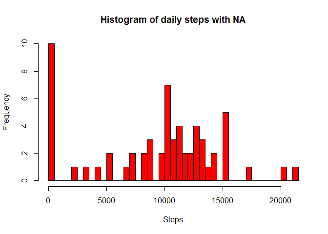
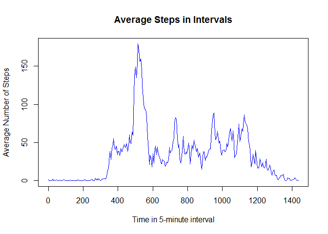
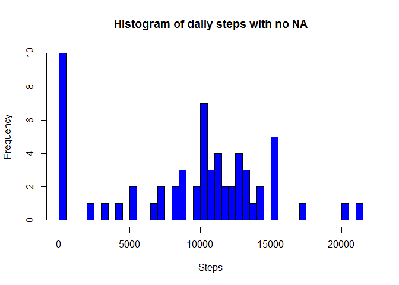
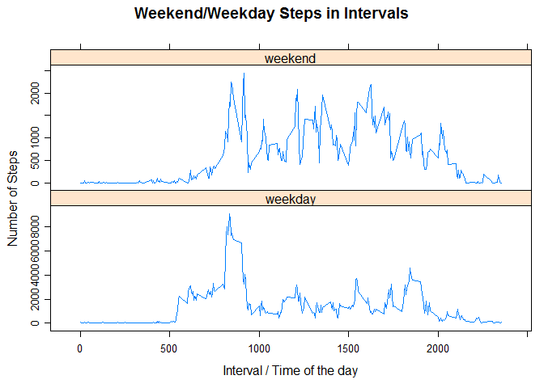

# Reproducible Research: Peer Assessment 1

```r
library(data.table)
library(ggplot2)
library(lattice)
```

## 1. Loading and preprocessing the data
a. Load the data (i.e. read.csv())


```r
activity <- fread('activity/activity.csv')
```


```r
dim(activity)
```

```
## [1] 17568     3
```


```r
head(activity,3)
```

```
##    steps       date interval
## 1:    NA 2012-10-01        0
## 2:    NA 2012-10-01        5
## 3:    NA 2012-10-01       10
```

b. Process/transform the data (if necessary) into a format suitable for your analysis

No need at the moment

## 2. What is mean total number of steps taken per day?

For this part of the assignment, you can ignore the missing values in the data set.

a. Calculate the total number of steps taken per day

```r
stepsByDate <- tapply(activity$steps,activity$date,sum,na.rm=T)
stepsByDate
```

```
## 2012-10-01 2012-10-02 2012-10-03 2012-10-04 2012-10-05 2012-10-06 
##          0        126      11352      12116      13294      15420 
## 2012-10-07 2012-10-08 2012-10-09 2012-10-10 2012-10-11 2012-10-12 
##      11015          0      12811       9900      10304      17382 
## 2012-10-13 2012-10-14 2012-10-15 2012-10-16 2012-10-17 2012-10-18 
##      12426      15098      10139      15084      13452      10056 
## 2012-10-19 2012-10-20 2012-10-21 2012-10-22 2012-10-23 2012-10-24 
##      11829      10395       8821      13460       8918       8355 
## 2012-10-25 2012-10-26 2012-10-27 2012-10-28 2012-10-29 2012-10-30 
##       2492       6778      10119      11458       5018       9819 
## 2012-10-31 2012-11-01 2012-11-02 2012-11-03 2012-11-04 2012-11-05 
##      15414          0      10600      10571          0      10439 
## 2012-11-06 2012-11-07 2012-11-08 2012-11-09 2012-11-10 2012-11-11 
##       8334      12883       3219          0          0      12608 
## 2012-11-12 2012-11-13 2012-11-14 2012-11-15 2012-11-16 2012-11-17 
##      10765       7336          0         41       5441      14339 
## 2012-11-18 2012-11-19 2012-11-20 2012-11-21 2012-11-22 2012-11-23 
##      15110       8841       4472      12787      20427      21194 
## 2012-11-24 2012-11-25 2012-11-26 2012-11-27 2012-11-28 2012-11-29 
##      14478      11834      11162      13646      10183       7047 
## 2012-11-30 
##          0
```

b. If you do not understand the difference between a histogram and a barplot, research the difference between them. Make a histogram of the total number of steps taken each day

```r
stepsByDate <- melt(stepsByDate)
names(stepsByDate) <- c('date','steps')
```

```r
hist(stepsByDate$steps,col = 'red',breaks = length(stepsByDate$steps),xlab='Steps', main ='Histogram of daily steps with NA')
```

<!-- -->

```r
head(stepsByDate,3)
```

```
##         date steps
## 1 2012-10-01     0
## 2 2012-10-02   126
## 3 2012-10-03 11352
```

c.Calculate and report the mean and median of the total number of steps taken per day

```r
mean(stepsByDate$steps)
```

```
## [1] 9354.23
```

```r
median(stepsByDate$steps)
```

```
## [1] 10395
```

#####Answer: the mean of steps taken per day is 9354.23, the median is 10395

## 3. What is the average daily activity pattern?
a. Make a time series plot (i.e. type = "l") of the 5-minute interval (x-axis) and the average number of steps taken, averaged across all days (y-axis)


```r
stepSumByInterval <- melt(tapply(activity$steps,activity$interval,sum,na.rm=T))
names(stepSumByInterval) <- c('interval','steps')
```

get the no. days

```r
length(unique(activity$date))
```

```
## [1] 61
```

However, the interval is not intuitive.


```r
class(stepSumByInterval$interval)
```

```
## [1] "integer"
```

```r
stepSumByInterval$interval <- formatC(stepSumByInterval$interval, width = 4, flag='0')
head(stepSumByInterval,3)
```

```
##   interval steps
## 1     0000    91
## 2     0005    18
## 3     0010     7
```

Notice that the interval is in a format of hours and minutes. This is homogenous time series.

```r
intervalTime <- strptime(stepSumByInterval$interval,'%H%M')
intervalHour <- hour(intervalTime)
intervalMin <- minute(intervalTime)
stepSumByInterval$interval <- intervalHour*60 + intervalMin
```

```r
plot(stepSumByInterval$interval,stepSumByInterval$steps / 61, pch=19, type='l',col="blue",xlab = "Time in 5-minute interval", ylab="Average Number of Steps", main = "Average Steps in Intervals")
```

<!-- -->

b. Which 5-minute interval, on average across all the days in the data set, contains the maximum number of steps?


```r
which.max(stepSumByInterval$steps)
```

```
## [1] 104
```


```r
stepSumByInterval[104,]
```

```
##     interval steps
## 104      515 10927
```

#####Interval 515 translate to the interval starts at the 515th minute of the day, which is the interval starts at 08:35 AM

#####Answer: the maximum of average steps of 5- minute interval occured on 08:35 AM

## 4. Imputing missing values

Note that there are a number of days/intervals where there are missing values (coded as NA). The presence of missing days may introduce bias into some calculations or summaries of the data.

a. Calculate and report the total number of missing values in the data set (i.e. the total number of rows with NAs)


```r
x <- is.na(activity)
head(x)
```

```
##      steps  date interval
## [1,]  TRUE FALSE    FALSE
## [2,]  TRUE FALSE    FALSE
## [3,]  TRUE FALSE    FALSE
## [4,]  TRUE FALSE    FALSE
## [5,]  TRUE FALSE    FALSE
## [6,]  TRUE FALSE    FALSE
```

```r
class(x)
```

```
## [1] "matrix"
```

```r
colSums(x)
```

```
##    steps     date interval 
##     2304        0        0
```
#####Answer: There are 2304 rows of NA in the activity data set. They are missing the value of steps.

b. Devise a strategy for filling in all of the missing values in the data set. The strategy does not need to be sophisticated. For example, you could use the mean/median for that day, or the mean for that 5-minute interval, etc.


Get the indices of steps which value is NA

```r
NAindex <- which(is.na(activity$steps))

length(NAindex)
```

```
## [1] 2304
```

```r
fillNA <- function(activity){
## make a copy of activity
  activityNoNA <- activity
## get the indice of missing values 
  NAindex <- which(is.na(activity$steps))
## get the sum of steps occurred by dates
  sumOfStepsByDate <- melt(tapply(activity$steps,activity$date, sum, na.rm=T))
  names(sumOfStepsByDate) <- c('dates','steps')
## only loop through the missing values, instead of all rows of activity
  for (i in 1:length(NAindex)){
    index <- NAindex[i]
    dateOftheMissingValue <- activity[index]$date
    temp <- sumOfStepsByDate[(sumOfStepsByDate$date == dateOftheMissingValue),]
    sumoftheSteps <- temp$steps
##there are 288 intervals in 1 day, the mean is the sum / no. intervals
    activityNoNA[index]$steps <- sumoftheSteps / 288
  }
  activityNoNA
}
```
c. Create a new data set that is equal to the original data set but with the missing data filled in.


```r
activityNoNA <- fillNA(activity)
sum(is.na(activityNoNA))
```

```
## [1] 0
```
d. Make a histogram of the total number of steps taken each day and Calculate and report the mean and median total number of steps taken per day. Do these values differ from the estimates from the first part of the assignment? What is the impact of imputing missing data on the estimates of the total daily number of steps?

```r
stepsByDateFilled <- melt(tapply(activityNoNA$steps, activityNoNA$date, sum))
names(stepsByDateFilled) <- c('date','steps')
summary(stepsByDateFilled)
```

```
##          date        steps      
##  2012-10-01: 1   Min.   :    0  
##  2012-10-02: 1   1st Qu.: 6778  
##  2012-10-03: 1   Median :10395  
##  2012-10-04: 1   Mean   : 9354  
##  2012-10-05: 1   3rd Qu.:12811  
##  2012-10-06: 1   Max.   :21194  
##  (Other)   :55
```

```r
hist(stepsByDateFilled$steps,col = 'blue',breaks = length(stepsByDateFilled$steps),xlab='Steps', main ='Histogram of daily steps with no NA')
```

<!-- -->
 
#####Answer: No difference.Because I had na.rm =T in Question 2 and it happens that all the NA exists in days that the sum of steps is zero.

Please see the following code for proof.

```r
x<-activity[NAindex,]
```

```r
unique(x$date)
```

```
## [1] "2012-10-01" "2012-10-08" "2012-11-01" "2012-11-04" "2012-11-09"
## [6] "2012-11-10" "2012-11-14" "2012-11-30"
```

```r
stepsByDate[(stepsByDate$steps == 0),]
```

```
##          date steps
## 1  2012-10-01     0
## 8  2012-10-08     0
## 32 2012-11-01     0
## 35 2012-11-04     0
## 40 2012-11-09     0
## 41 2012-11-10     0
## 45 2012-11-14     0
## 61 2012-11-30     0
```
Further checking a specific date to verify results.

```r
activity[(activity$date == '2012-10-01'),steps]
```

```
##   [1] NA NA NA NA NA NA NA NA NA NA NA NA NA NA NA NA NA NA NA NA NA NA NA
##  [24] NA NA NA NA NA NA NA NA NA NA NA NA NA NA NA NA NA NA NA NA NA NA NA
##  [47] NA NA NA NA NA NA NA NA NA NA NA NA NA NA NA NA NA NA NA NA NA NA NA
##  [70] NA NA NA NA NA NA NA NA NA NA NA NA NA NA NA NA NA NA NA NA NA NA NA
##  [93] NA NA NA NA NA NA NA NA NA NA NA NA NA NA NA NA NA NA NA NA NA NA NA
## [116] NA NA NA NA NA NA NA NA NA NA NA NA NA NA NA NA NA NA NA NA NA NA NA
## [139] NA NA NA NA NA NA NA NA NA NA NA NA NA NA NA NA NA NA NA NA NA NA NA
## [162] NA NA NA NA NA NA NA NA NA NA NA NA NA NA NA NA NA NA NA NA NA NA NA
## [185] NA NA NA NA NA NA NA NA NA NA NA NA NA NA NA NA NA NA NA NA NA NA NA
## [208] NA NA NA NA NA NA NA NA NA NA NA NA NA NA NA NA NA NA NA NA NA NA NA
## [231] NA NA NA NA NA NA NA NA NA NA NA NA NA NA NA NA NA NA NA NA NA NA NA
## [254] NA NA NA NA NA NA NA NA NA NA NA NA NA NA NA NA NA NA NA NA NA NA NA
## [277] NA NA NA NA NA NA NA NA NA NA NA NA
```

## 5. Are there differences in activity patterns between weekdays and weekends?


```r
intervalSumOfDate <- melt(tapply(activity$steps,list(activity$date,activity$interval),sum,na.rm = T))
```

```r
head(intervalSumOfDate,3)
```

```
##         Var1 Var2 value
## 1 2012-10-01    0     0
## 2 2012-10-02    0     0
## 3 2012-10-03    0     0
```

```r
names(intervalSumOfDate) <- c('date','interval','steps')
activityWeekday <- weekdays(as.Date(intervalSumOfDate$date))

setWeekend <- function(activityWeekday){
  copy <-activityWeekday
  for(i in 1:length(activityWeekday)){
    if (activityWeekday[i] %in% c("Monday","Tuesday","Wednesday","Thursday","Friday")){
      copy[i] <- 'weekday'
      }
    if (activityWeekday[i] %in% c("Saturday","Sunday")){
      copy[i] <- 'weekend'
    }
  }
  copy
}
activityWeekday <- setWeekend(activityWeekday)

intervalSumOfDate <- cbind(activityWeekday,intervalSumOfDate)
```


```r
head(intervalSumOfDate)
```

```
##   activityWeekday       date interval steps
## 1         weekday 2012-10-01        0     0
## 2         weekday 2012-10-02        0     0
## 3         weekday 2012-10-03        0     0
## 4         weekday 2012-10-04        0    47
## 5         weekday 2012-10-05        0     0
## 6         weekend 2012-10-06        0     0
```

```r
stepSumByIntervalByWeekday <- melt(tapply(intervalSumOfDate$steps, list(intervalSumOfDate$activityWeekday,intervalSumOfDate$interval),sum))
names(stepSumByIntervalByWeekday) <- c("isWeekday",'interval','steps')
```

```r
xyplot(steps~interval|isWeekday,data=stepSumByIntervalByWeekday,type="l",scales=list(y=list(relation="free")),layout=c(1,2),xlab = 'Interval / Time of the day', ylab = 'Number of Steps', main = 'Weekend/Weekday Steps in Intervals')
```

<!-- -->

```r
summary(stepSumByIntervalByWeekday[(stepSumByIntervalByWeekday$isWeekday=='weekday'),])
```

```
##    isWeekday      interval          steps       
##  weekday:288   Min.   :   0.0   Min.   :   0.0  
##  weekend:  0   1st Qu.: 588.8   1st Qu.:  86.5  
##                Median :1177.5   Median : 935.0  
##                Mean   :1177.5   Mean   :1378.2  
##                3rd Qu.:1766.2   3rd Qu.:2023.0  
##                Max.   :2355.0   Max.   :9130.0
```

```r
summary(stepSumByIntervalByWeekday[(stepSumByIntervalByWeekday$isWeekday=='weekend'),])
```

```
##    isWeekday      interval          steps       
##  weekday:  0   Min.   :   0.0   Min.   :   0.0  
##  weekend:288   1st Qu.: 588.8   1st Qu.:  15.5  
##                Median :1177.5   Median : 448.5  
##                Mean   :1177.5   Mean   : 603.1  
##                3rd Qu.:1766.2   3rd Qu.:1058.0  
##                Max.   :2355.0   Max.   :2450.0
```
#####Answer: The weekday and weekend activity patterns are different. On weekdays,subject is more active with higher mean of step. However, activity is more spead out during weekends and concentrated in the morning on weekdays.
